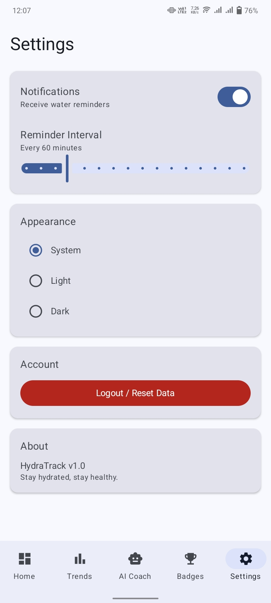

**HydraTrack** is a high-performance mobile application designed to solve the common problem of inconsistent hydration. Unlike standard water trackers, HydraTrack leverages Artificial Intelligence to act as a personal wellness coach rather than just a digital logbook.

## Features

*Secure Onboarding*: The journey begins with a robust Firebase Authentication flow, allowing users to securely Sign Up, Login, or recover their account via a "Forgot Password" link that triggers an automated reset email.

*Profile Personalization*: Upon entering the app, users set up their physical profile—including weight, age, and activity level—which is stored in Cloud Firestore to calculate a customized baseline hydration goal.

*Smart Dashboard*: Users land on an intuitive interface featuring a Real-time Progress Indicator that visually fills as they log water intake using quick-action buttons (250ml, 500ml, 1L).

*AI-Powered Coaching*: From the dashboard, users can engage with an Integrated Gemini AI Assistant to get real-time, context-aware advice, such as adjusting water targets after a workout or understanding dehydration symptoms.

*Proactive Engagement*: The app maintains consistency through Smart Reminders that nudge the user based on their current progress, while all data is Synchronized across devices for a seamless experience.

*Insightful History*: Finally, the user can review their Hydration Trends in a dedicated history view, allowing them to track long-term wellness improvements and consistency streaks.

## TechStack

Kotlin, Jetpack Compose, Material 3, Clean Architecture, MVVM, Hilt, Coroutines, StateFlow, Firebase, Gemini AI.

## App Screenshots

| Home Screen | Profile Setup | Log Intake |
| :---: | :---: | :---: |
|  |  |  |

| AI Coach | Achievements | Weekly Trends |
| :---: | :---: | :---: |
|  |  |  |

| Settings |
| :---: |
|  |

## Prerequisites

*Android Studio (Latest Version)* , 
*JDK 21* , 
*A physical device or an emulator (x86_64, API 33+ recommended)*

## Installation

Clone the repository:

Bash
git clone https://github.com/yourusername/HtdraTrack.git

Open the project in Android Studio.

Allow Gradle to sync and download necessary dependencies.

Build and run the project on your device.

## Connect With Me

I am a native Android Developer specializing in building high-quality, scalable applications.

LinkedIn: https://www.linkedin.com/in/qamar-jamshed-251119288

Fiverr: https://www.fiverr.com/qamarkhattak/buying?source=avatar_menu_profile

*Copyright 2026. All rights reserved.*
